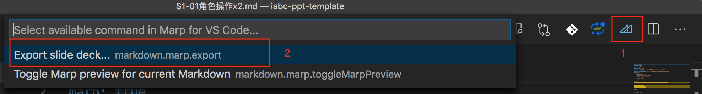

## 1. 角色操作
#### 课时：2课时

---

# 内容简介

- 舞台背景，角色坐标
- 创建角色
- 绘制角色
- 角色基本操作：更换造型，移动

---

# 课堂总结：

- 

#### 作业：
- 

---

# VSCode 配置 1

1. Install Marp plugin.

---

# VSCode 配置 2

2. Editing.

---

# VSCode 配置 3

3. Export: support HTML, PDF and PPT.

---

# 文件命名规则：

类别+等级-序号x课时，1课时可以省略。